# Java Sticker Exchange

A multiplayer **sticker-trading system** built in Java 21. Each player owns a digital album of
stickers numbered **1–99**. Players have **duplicates** (stickers they own more than once and can
give away) and **missing** stickers (gaps they want to fill). A central server connects all online
players, calculates which trades are possible, and safely applies sticker swaps between two albums.

The project is split into three Maven modules:

| Module   | Responsibility                                                              |
|----------|-----------------------------------------------------------------------------|
| `common` | Shared domain model, network protocol messages, and matching services.      |
| `server` | TCP server that hosts all players and enforces the rules of trading.        |
| `client` | Swing desktop GUI (MVC) that players use to edit albums and propose trades.  |

### Features

- Random starter album generated for every new player.
- Live editing of duplicates / missing stickers (mutually exclusive, range 1–99).
- Automatic **match-finding** against every other online player.
- Trade proposals with **accept / decline** handshakes.
- **Two-phase-commit** safety: a trade is re-validated against the latest albums before it is applied.
- Fully thread-safe server core, one background thread per connected client.

---

## 1. High-Level System Architecture

The system is a classic **client–server** design. Many Swing clients connect over TCP to a single
server. Both sides depend on the shared `common` module so they speak the exact same object protocol.

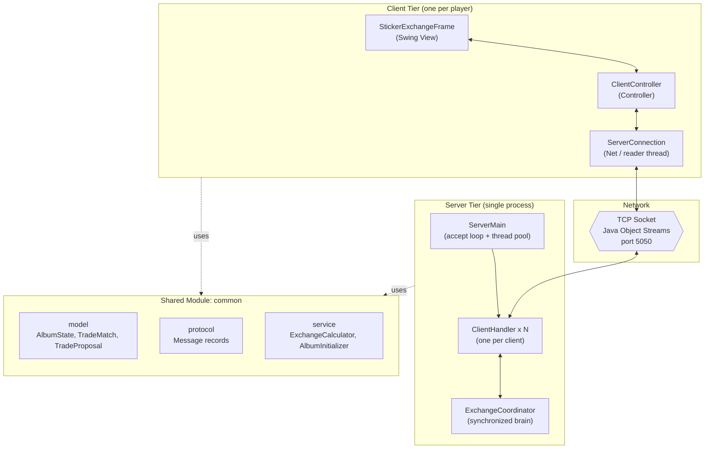

---

## 2. Maven Module Dependency Graph

`common` is the foundation. Both `server` and `client` depend on it; they never depend on each
other — they only communicate at runtime through serialized protocol messages.

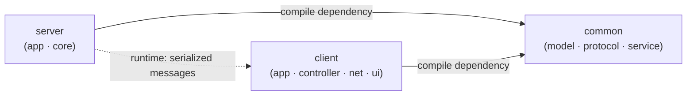

---

## 3. Deployment / Network Topology

A single server process accepts many simultaneous players. Each connection is an independent TCP
socket carrying serialized Java objects.

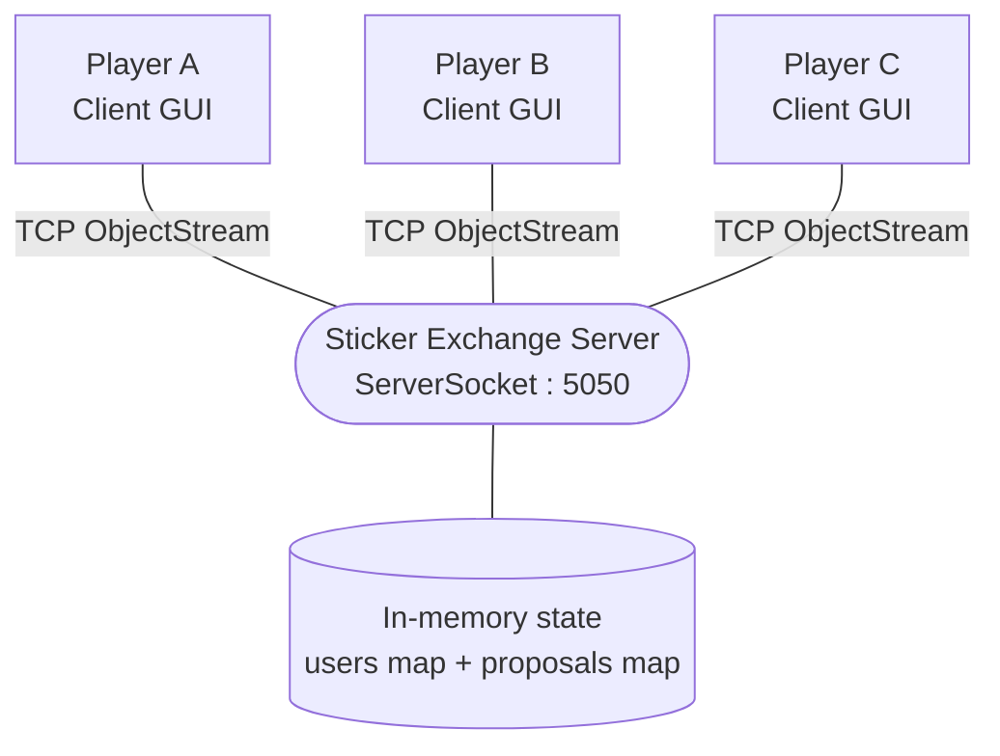

---

## 4. Domain Model (Class Diagram)

The domain is built from immutable Java **records**. `AlbumState` is the core value object; trades
are described by `TradeMatch` (a discovered opportunity) and `TradeProposal` (a formal offer).

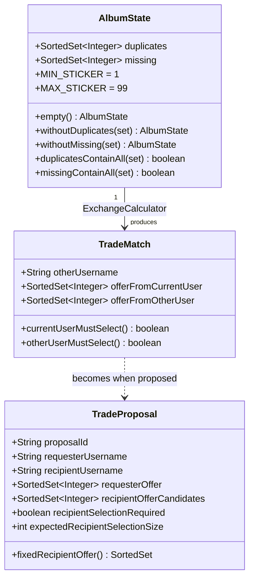

---

## 5. Protocol Message Catalog (Class Diagram)

Every object sent across the wire implements the `Message` marker interface. Requests flow
client → server; responses and events flow server → client.

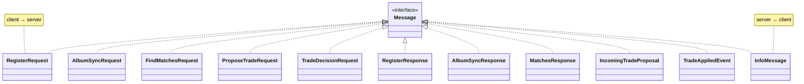

| Direction        | Message                | Purpose                                          |
|------------------|------------------------|--------------------------------------------------|
| client → server  | `RegisterRequest`      | Claim a username.                                |
| server → client  | `RegisterResponse`     | Success/failure + starter album.                 |
| client → server  | `AlbumSyncRequest`     | Save the edited album.                            |
| server → client  | `AlbumSyncResponse`    | Confirm the stored album.                        |
| client → server  | `FindMatchesRequest`   | Ask for all current trade opportunities.         |
| server → client  | `MatchesResponse`      | List of `TradeMatch` results.                    |
| client → server  | `ProposeTradeRequest`  | Offer a trade to another player.                 |
| server → client  | `IncomingTradeProposal`| Deliver a proposal to the recipient.             |
| client → server  | `TradeDecisionRequest` | Accept or decline a proposal.                    |
| server → client  | `TradeAppliedEvent`    | A completed trade + updated album.               |
| server → client  | `InfoMessage`          | Status / error / confirmation text.              |

---

## 6. Server Components

`ServerMain` owns the accept loop and a thread pool. Each `ClientHandler` runs on its own thread
but routes all decisions through the **single** `ExchangeCoordinator`, which owns all shared state.

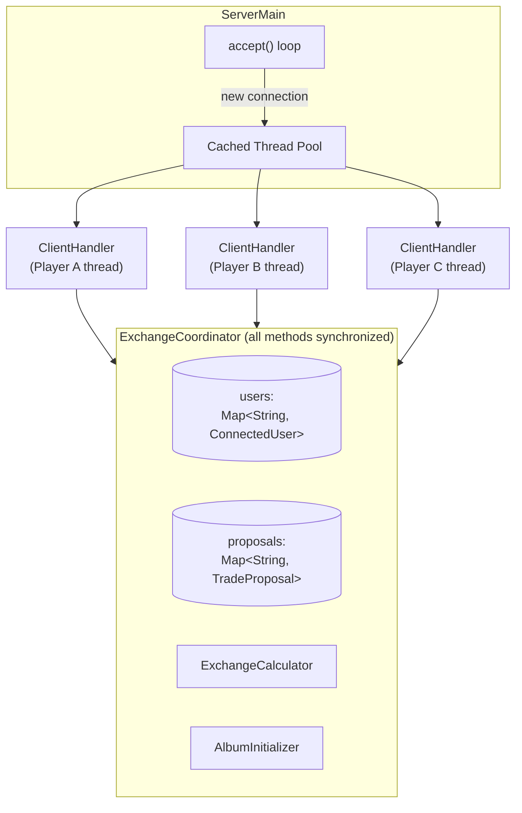

---

## 7. Client Components (MVC)

The client follows the **Model-View-Controller** pattern. The controller is the hub: it turns UI
actions into protocol messages and routes incoming messages back onto the Swing UI thread (EDT).

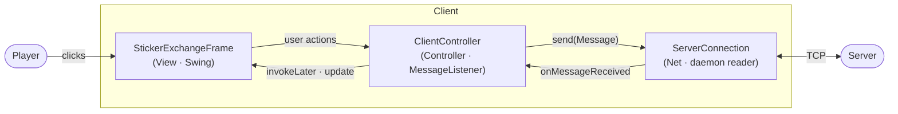

---

## 8. Threading Model

Concurrency is the heart of the design: many client threads on the server funnel through a single
`synchronized` coordinator, while the client keeps networking off the UI thread.

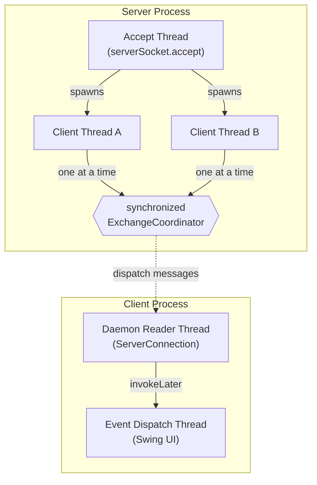

---

## 9. Sequence — Registration & Starter Album

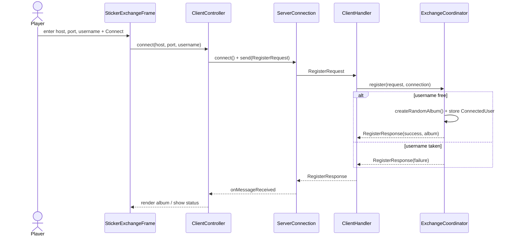

---

## 10. Sequence — Save Album & Find Matches

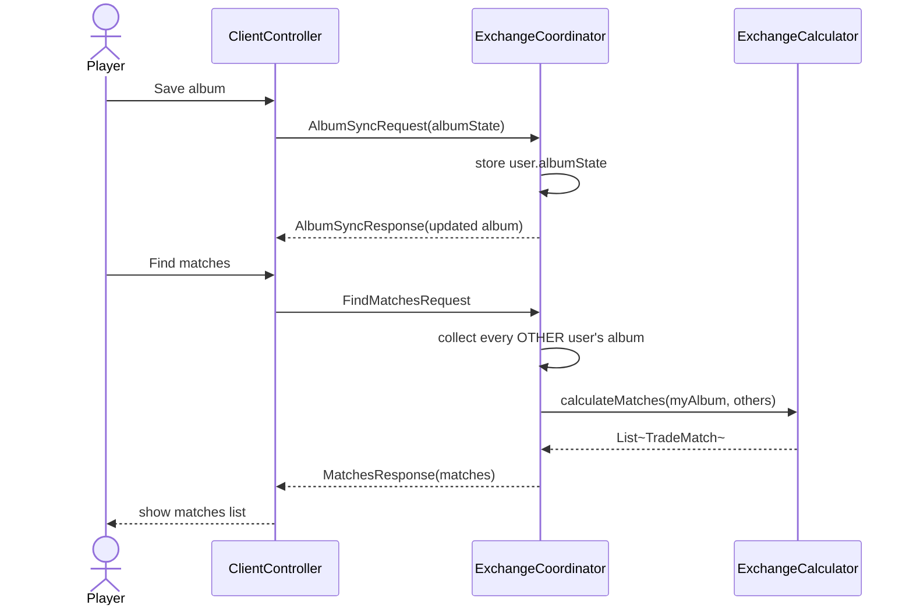

---

## 11. Sequence — Propose Trade

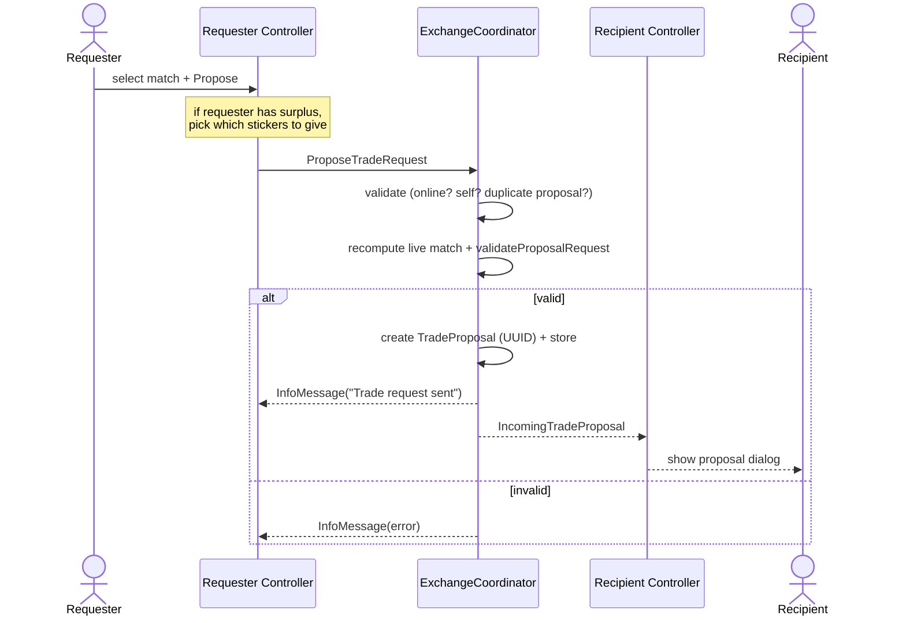

---

## 12. Sequence — Respond to Trade (Accept, Two-Phase Commit)

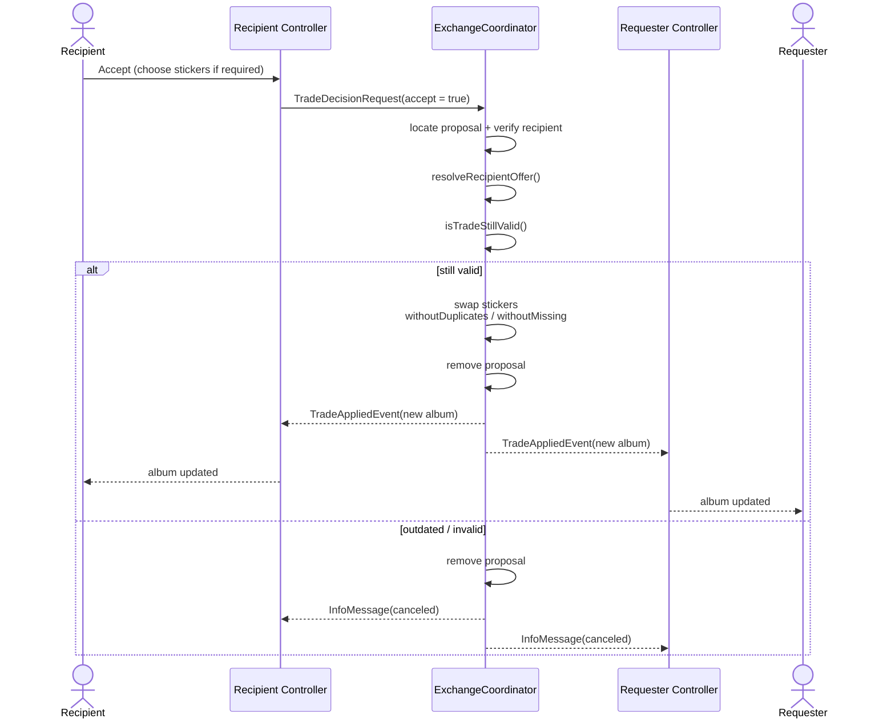

---

## 13. Matching Algorithm (ExchangeCalculator)

A trade between two players exists when each can fill a gap in the other's album. The calculator
intersects one player's **duplicates** with the other's **missing** stickers, in both directions.

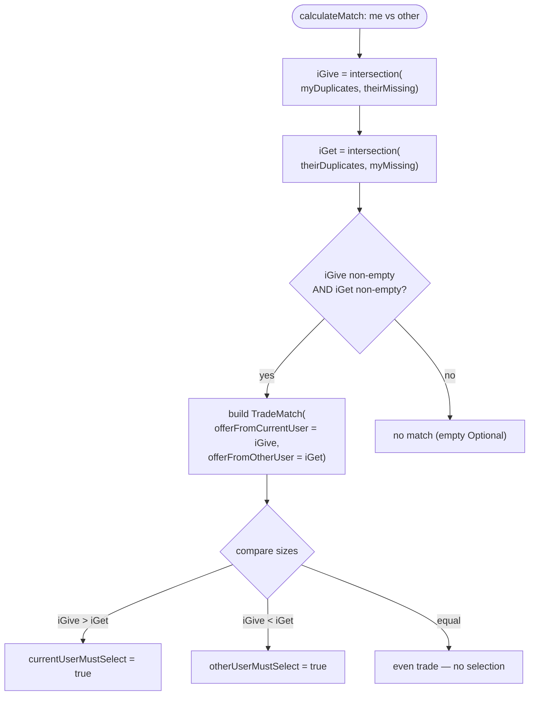

---

## 14. Trade Validation & Two-Phase Commit (Decision Flow)

The server never trusts a stale proposal. It classifies the trade shape (cases A–D) at proposal
time, then **re-validates against the live albums** at acceptance time before mutating any state.

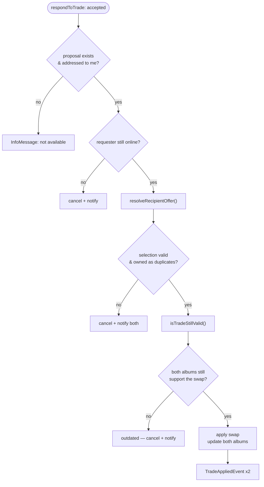

---

## 15. Proposal Lifecycle (State Diagram)

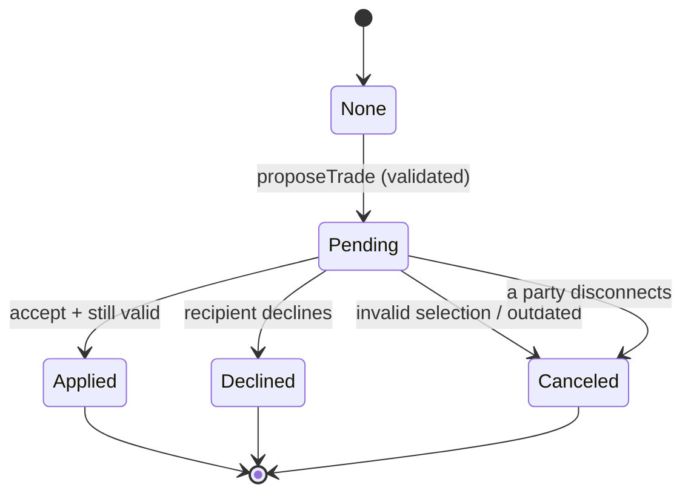

---

## 16. Client Connection Lifecycle (State Diagram)

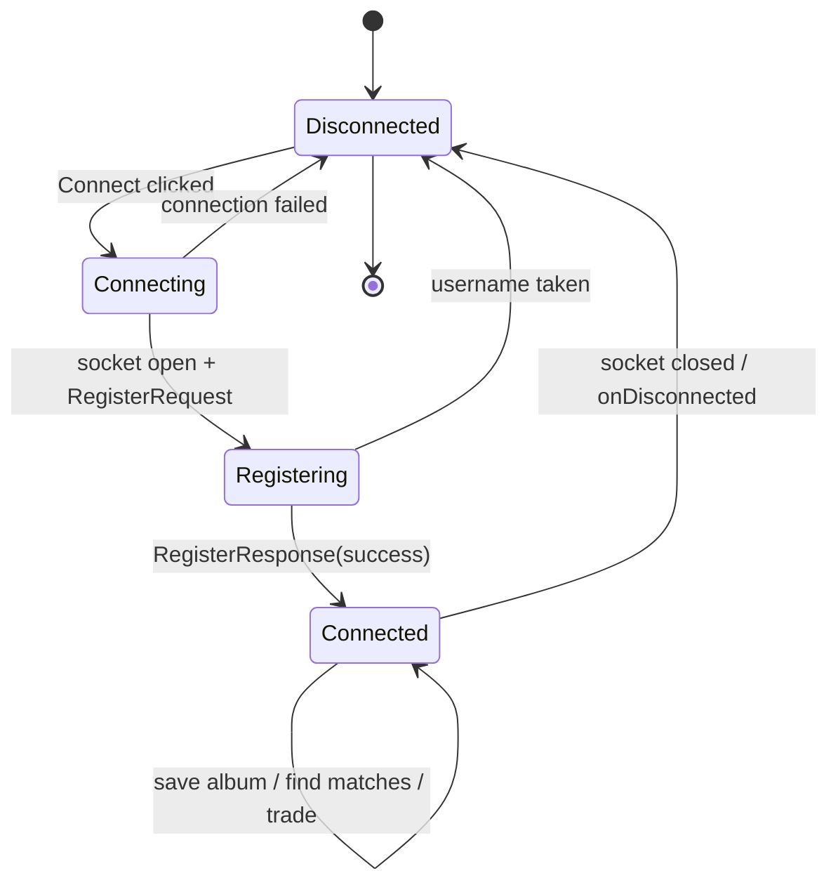

---

## 17. Project Layout

```ini
java-sticker-exchange/
├── pom.xml                       # parent / aggregator module
├── common/                       # shared, framework-free module
│   └── com/stickerexchange/common/
│       ├── model/                # AlbumState, TradeMatch, TradeProposal
│       ├── protocol/             # Message records (requests/responses/events)
│       ├── service/              # ExchangeCalculator, AlbumInitializer
│       └── util/                 # StickerSets
├── server/
│   └── com/stickerexchange/server/
│       ├── app/                  # ServerMain (+ ClientHandler)
│       └── core/                 # ExchangeCoordinator (the brain)
└── client/
    └── com/stickerexchange/client/
        ├── app/                  # ClientMain
        ├── controller/           # ClientController (MVC)
        ├── net/                  # ServerConnection
        └── ui/                   # StickerExchangeFrame (Swing)

```

---

## 18. Build & Run

Requirements: **JDK 21+** and **Maven 3.9+**.

### Build all modules

```powershell
mvn install -DskipTests -q

```

### Start the server (default port 5050)

```powershell
mvn -pl server org.codehaus.mojo:exec-maven-plugin:3.5.0:java "-Dexec.mainClass=com.stickerexchange.server.app.ServerMain"

```

To use a custom port, pass it as an argument (e.g. append `-Dexec.args="6000"`).

### Start a client GUI (run one per player)

```powershell
mvn -pl client org.codehaus.mojo:exec-maven-plugin:3.5.0:java "-Dexec.mainClass=com.stickerexchange.client.app.ClientMain"

```

> Tip: these commands are also available as the **Build Modules**, **Run Server**, and
> **Run Client GUI** VS Code tasks.

### Typical session

1. Start the server.
2. Launch two or more client GUIs.
3. In each client, enter host (`localhost`), port (`5050`), and a unique username, then **Connect**.
4. Edit your duplicates / missing stickers and **Save album**.
5. Click **Find matches**, pick a player, and **Propose trade**.
6. The recipient accepts or declines; on success, both albums update instantly.